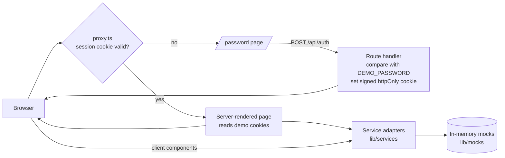
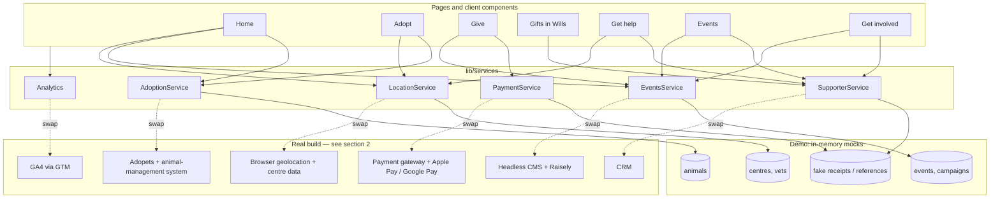
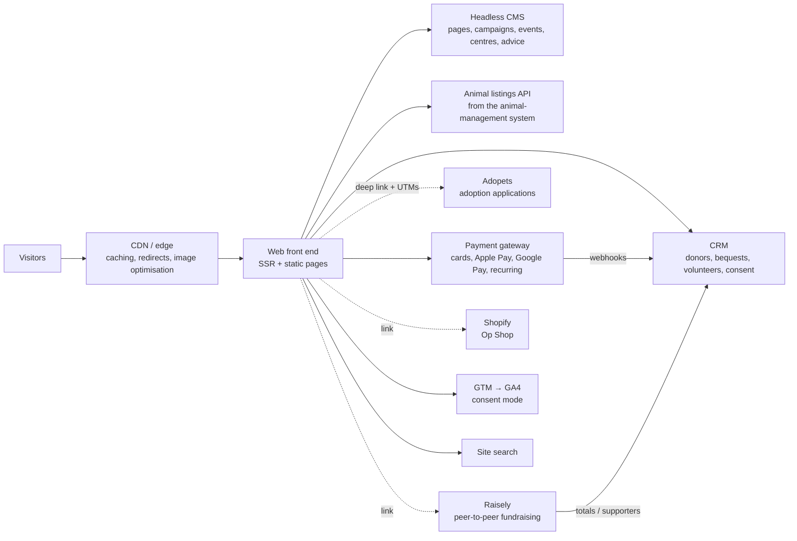

# Architecture

> **Everything is a mock — payments, integrations and data. No real transactions or personal data are processed.**

This document describes two things:

1. **The demo** — how this prototype is put together.
2. **A real implementation** — an approximate picture of what each piece would connect to on a replatformed spca.nz.

Anything about SPCA's current systems that isn't public is marked **Assumption**. I have not seen SPCA's internal architecture, contracts or data.

---

## 1. The demo

### Stack

- **Next.js 16** (App Router, React Server Components), **TypeScript**, **Tailwind CSS 4**
- Hosted on **Vercel** (free plan), functions in `syd1`
- No database, no user accounts, no paid services, no third-party scripts
- The only secret is `DEMO_PASSWORD` (a Vercel environment variable; `.env.local` for local runs)

### Request flow



- `proxy.ts` (Next 16's replacement for middleware) runs on every request except build assets (`/_next/static`), `robots.txt` and the favicon. Pages **and** photos in `/public/photos` need the cookie.
- The session cookie is `v1.<expiry>.<HMAC-SHA256>` keyed by `DEMO_PASSWORD`, `httpOnly`, `Secure`, `SameSite=Lax`, 14 days. Rotating the password invalidates every session.
- Every response carries `X-Robots-Tag: noindex, nofollow`; pages also have a robots meta tag; `robots.txt` disallows everything.

### Demo state

The Demo panel writes plain cookies that the server reads, so the first paint is already right (no flash of the wrong campaign):

| Cookie | Meaning |
|---|---|
| `demo_date` | Simulated NZ date (drives campaign mode, event status, progress) |
| `demo_time` | `day` or `evening` (drives "open now" and the after-hours route) |
| `demo_loc` | Centre ID + coordinates + source (`gps` or `manual`) |
| `demo_given` | Running total of mock gifts, added to the campaign progress bar |

Favourites live in `localStorage`. All dates are handled as New Zealand wall-clock time.

### Route map

| Route | Purpose | Direction |
|---|---|---|
| `/` | Home: campaign-aware hero, four goals, nearest centre, What's on strip, animals near you | 1, 3 |
| `/adopt` | Listing: species, children, other animals, **energy**, **experience**, age, size, centre; sort nearest / newest / long-stay; favourites | 1 |
| `/adopt/match` | 60-second quiz that pre-sets the listing filters | 1 |
| `/adopt/[id]` | Profile: photo first, at-a-glance, readiness checklist, sticky "Apply for {name}" | 1 |
| `/adopt/[id]/apply` | Hand-off screen, then a labelled mock of the Adopets application | 1 |
| `/adopt/ready` | "Are you ready to adopt?" guide | 1 |
| `/give` | One-page donation: impact ladder, once/monthly, live goal, simulated wallets | 2 |
| `/give/thank-you` | Outcome of the gift, your slice of the goal, gentle monthly upsell | 2 |
| `/give/gifts-in-wills` | One first step (information pack), Giving Hearts benefits, named contact | 2 |
| `/get-help` | Report-cruelty triage: danger now → centre / after-hours vet / 111 / DOC; full guidance collapsed | 1 |
| `/get-help/report` | Multi-step non-urgent report | 1 |
| `/get-involved` | Volunteer, foster, fundraise, events, Op Shops | 1, 3 |
| `/events` | Year calendar filterable by centre and type; every event has a CTA | 3 |
| `/about-this-demo` | Tour, what's mocked, photo credits | — |
| `/password`, `/api/auth`, `/api/logout` | Password gate | — |

### Component structure

```
app/
  layout.tsx                 fonts, metadata (noindex)
  password/                  the only page outside the gate
  (site)/layout.tsx          concept banner + Demo panel, header, footer (reads demo state)
  (site)/…                   the routes above — server components by default
components/
  ConceptBanner, DemoPanel   persistent disclaimer and interviewer controls
  SiteHeader, MobileMenu, LocationChip, LocationPicker, SiteFooter
  Sheet                      accessible <dialog> used for every modal / bottom sheet
  CallButton, MockNotice     "would call / would open" dialogs — nothing leaves the site
  AnimalCard, FavouriteButton, Photo
  EventCard, EventCta, WhatsOnStrip
  adopt/   AdoptBrowser (client filtering + URL sync), filters, MatchQuiz, AdopetsMock
  give/    DonateForm, AppealProgress, MonthlyUpsell, BequestPackForm
  help/    Triage, ReportForm
lib/
  services/                  the adapter layer (below)
  mocks/                     in-memory data: animals, centres, events, campaigns, impact ladder
  auth.ts, demo-*.ts, time.ts, favourites.ts, image-loader.ts
scripts/build-photos.mjs     downloads Unsplash photos, writes resized WebP + manifest
```

Client JavaScript is limited to interactive islands (filters, forms, dialogs, the Demo panel). Photos are pre-sized WebP files served through `next/image` with a custom loader, so the password gate also covers them and no image-optimisation service is needed.

### Service adapters

Pages never touch mock data directly; they call a typed service. Swapping a mock for a real integration means re-implementing one module.



| Adapter | Mocked now | Real integration |
|---|---|---|
| **AdoptionService** (`lib/services/adoption.ts`) | 27 invented animals; "days in care" is relative to the simulated date; the hand-off builds a URL on a `.example` domain that is never opened | Read API over the animal-management system, cached and refreshed every few minutes. Apply = deep link into **Adopets** carrying `animal_id`, `centre` and `utm_source/medium/campaign/content`, so applications can be attributed to pages and campaigns. |
| **PaymentService** (`payment.ts`) | Waits 1.2 s and returns a fake receipt. No card fields exist. | A PCI-compliant **payment gateway** with **Apple Pay and Google Pay**, hosted card fields (card data never touches SPCA servers), recurring billing for monthly gifts, and webhooks into the CRM for receipts and tax-credit statements. |
| **SupporterService** (`supporter.ts`) | Every form resolves in the browser with a fake reference | The **CRM** for donors, monthly upgrades and **bequest leads**; cruelty reports routed to the Inspectorate's case system; event and volunteer sign-ups synced; consent captured per purpose. |
| **EventsService** (`events.ts`) | Events generated per year in code; campaign windows hard-coded; progress is a deterministic curve | Events, campaigns and appeal goals as content types in a **headless CMS** (start/end dates, centre, CTA, hero). Peer-to-peer campaigns (Cupcake Day, personal fundraisers) and their live totals from **Raisely**. |
| **LocationService** (`location.ts`) | 13 centres with approximate coordinates and placeholder hours/phones; invented after-hours vets | Centre data from the CMS (or the operational system of record), browser geolocation on the client, and a maintained list of partner after-hours clinics. |
| **Analytics** (`analytics.ts`) | Events kept in memory and shown in the Demo panel | **GA4 via Google Tag Manager** with a documented event schema (these names), consent mode, and server-side tagging for donation and application conversions. |

Other platforms around spca.nz would stay separate but be linked properly: **Shopify** for the online Op Shop, and the existing microsites until their content is migrated.

---

## 2. A real implementation (approximate)



Principles:

- **Content where editors work.** Campaign mode, the events calendar, centre details and the impact ladder should all be editable in the CMS, with scheduled start and end dates — not deployments.
- **Integrations behind adapters.** The same pattern as the demo: the front end talks to typed services, so a vendor change (payment gateway, CRM) doesn't ripple through every page.
- **Measure the journeys, not just pageviews.** One event schema across spca.nz, Adopets, Raisely and the payment gateway, so "campaign → page → application / gift" can be reported end to end.
- **Performance and SEO as launch criteria.** An image pipeline (resized, modern formats, prioritised hero), a full redirect map from every old URL, and structured data for animals and events.
- **Accessibility as a definition of done.** WCAG 2.2 AA checks in the delivery pipeline and in UAT.

### Assumptions to validate

- **Assumption:** SPCA's current CMS is not publicly identifiable (the site is custom PHP behind nginx); the target CMS and delivery partner are not public.
- **Assumption:** SPCA's CRM is not publicly known. The demo's `SupporterService` is written against a generic CRM interface.
- **Assumption:** Adopets supports deep links that carry an animal ID and UTM parameters into the application; the exact parameter names would come from Adopets.
- **Assumption:** Animal listings can be read from the animal-management system via an API or a scheduled export.
- **Assumption:** The payment gateway behind today's donation form can support Apple Pay and Google Pay, or would be replaced during the replatform.
- **Assumption:** Raisely remains the peer-to-peer platform and exposes campaign totals via its API.
- **Assumption:** Centre opening hours and after-hours vet partners are maintained centrally somewhere that the CMS can use.

These are exactly the questions I'd take into discovery in the first weeks.
